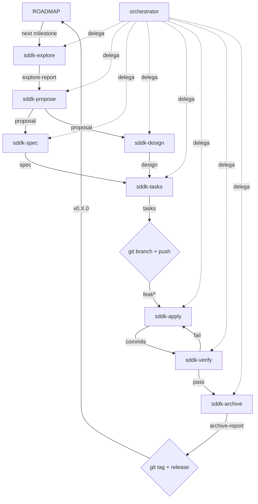

# Hodei Diagrams — AGENTS.md

## 1. Proyecto

**Hodei Diagrams** es una plataforma de diagramación cuyo núcleo es un **motor reutilizable** en Rust
(Semantic Port de draw.io/diagrams.net con compatibilidad `.drawio`). El editor visual,
la compatibilidad `.drawio` y futuros clientes automatizados son clientes de ese motor.

- Repo: `/var/home/rubentxu/Proyectos/rust/hodei-diagrams`
- Stack: Rust (2024 edition) + WASM + TypeScript Web Shell + SVG/WebGPU
- Paradigma: Hexagonal/Clean Architecture, command-driven, multi-crate workspace

---

## 2. Reglas del Toolchain (INVARIANTES — NO violar sin ADR)

### 2.1 Rust

- **Versión mínima**: `rustc 1.96.0` (2026) — verificar con `rustc --version`
- **Edition**: `2024` — NO usar `2018` ni `2021` sin ADR que lo justifique
- **MSRV**: 1.85 (edition 2024 requirement; el repo puede exigir más cuando sea necesario)
- Verificar toolchain antes de cualquier `cargo build`:
  ```bash
  rustc --version  # debe ser >= 1.95
  cargo --version  # debe ser >= 1.95
  ```

### 2.2 Crates

- **Regla general**: última versión estable de crates verificada en `crates.io`
- **Excepciones documentadas**: cualquier crate pinned a versión específica requiere ADR
- **Prohibidas en el core** (sin ADR que las justifique): `tokio`, `axum`, `dashmap`, `arc-swap`,
  `rmcp`, `sqlx`, `serde_yaml`, `notify`, `bincode` como decisión base
- **wasm32 target**: verificar soporte real antes de añadir crates con bindings wasm

### 2.4 Librerías JS/TS (web-shell)

- **Regla general**: última versión estable de paquetes npm verificada en `npmjs.com`
- **Excepciones documentadas**: cualquier paquete pinned a versión específica requiere ADR
- Verificar compatibilidad con el build tool (Vite o el que se elija) antes de actualizar

### 2.3 Formato y Linting

```bash
cargo fmt
cargo clippy --workspace --all-targets -- -D warnings
cargo check --workspace
```

Todo commit debe pasar `fmt + clippy + check` limpio.

---

## 3. Git y Conventional Commits

### 3.1 Flujo: Trunk-Based Development

- `main`: rama única de verdad. Protegida. Todo va a `main` vía PR.
- Ramas de feature: `feat/nombre`, `fix/nombre`, `chore/nombre`, `docs/nombre`, `refactor/nombre`
- NO hay ramas de release ni long-lived de desarrollo
- Merge: siempre merge commit (no rebase automático sobre main para preservar historial)
- PRs: título + descripción con referencia a ADR si aplica

### 3.2 Conventional Commits

```
<tipo>(<alcance>): <descripción corta>

[body opcional]

[footer con ADR o ticket]
```

Tipos:

| Tipo | Cuándo |
|------|--------|
| `feat` | nueva funcionalidad visible para el usuario o API |
| `fix` | corrección de bug |
| `docs` | cambios en documentación |
| `chore` | mantenimiento, dependencias, tooling, configuración |
| `refactor` | cambio de código sin cambio de comportamiento |
| `perf` | mejora de rendimiento |
| `test` | solo tests |
| `revert` | reversión de un commit anterior |

Ejemplos:
```
feat(core): add CellId with stable engine-owned identity
fix(format): correct edge label parsing in mxGraphModel
docs(adr): add 0029 on spatial index strategy
chore(deps): update quick-xml to 0.37
refactor(core): extract Geometry into its own store module
```

### 3.3 Estructura de Ramas

```
main (protected)
├── feat/drawio-raw-roundtrip-v1
├── feat/domain-mapping-v1
├── feat/diagram-commands
└── ...
```

> Las ramas de feature se crean DESPUÉS de `sddk-tasks` y ANTES de `sddk-apply`. Cada cambio SDDK
> completado tiene su propia rama. Ver §5.3 regla #7 (rama antes de apply, push inmediato al remote).

### 3.4 Flujo Git Completo (INVARIANTE)

El ciclo completo de un cambio SDDK:

```
sddk-tasks (último artefacto antes de código)
    ↓
git checkout -b feat/nombre-del-cambio
git push -u origin feat/nombre-del-cambio
    ↓
sddk-apply → commits atómicos por funcionalidad
git commit -m "feat(alcance): descripción"
    ↓ (repetir apply + commit por cada PR/tarea)
sddk-verify → commit fixes si necesario
    ↓
sddk-archive → commit final de cierre si aplica
    ↓
git push origin feat/nombre-del-cambio
gh pr create --title "feat(nombre): descripción" --body "Cierra #<issue>"
    ↓
Review y merge (merge commit, no fast-forward)
    ↓
# NO borrar la rama — preservar trazabilidad completa
# La rama vive en el remote como registro histórico
    ↓
git checkout main && git pull
    ↓
# Versionado semántico después de cada milestone completado
git tag -a v0.X.0 -m "feat: hito completado — descripción"
git push origin v0.X.0
    ↓
Siguiente cambio SDDK
```

**Reglas INVARIANTES del flujo:**

1. **Rama por cambio SDDK**: cada cambio SDDK archiveado vive en su propia rama de feature. No se mezclan dos cambios SDDK distintos en la misma rama.
2. **Commits convencionales por funcionalidad**: un commit = una funcionalidad atómica. Ejemplo: no hacer un commit que incluya "parseo Y tipos del dominio" en el mismo commit; partirlo en dos.
3. **Mensaje de commit**: `<tipo>(<alcance>): <descripción>`. Usar tipos de §3.2. Body opcional con contexto. Footer con ADR si aplica.
4. **Merge a main**: siempre merge commit ( `--no-ff`). No rebase sobre main. Preserva el historial del debate de review.
5. **Volver a main antes del siguiente cambio**: `git checkout main && git pull` antes de iniciar el siguiente ciclo SDDK.
6. **PR grande (>400 LOC)**: usar skill `chained-pr` para partirla en múltiples PRs encadenadas.
7. **main protegida**: nadie commitea directo a main. Todo pasa por PR con al menos un reviewer.
8. **Commits atómicos**: cada commit debe compilar (`cargo check`) y pasar tests (`cargo test`). No commitear código roto.
9. **Cerrar antes de abrir** (INVARIANTE): no se arranca un nuevo cambio SDDK hasta que el cambio anterior esté mergeado a `main` y se haya hecho `git checkout main && git pull`. No hay dos ciclos SDDK abiertos al mismo tiempo. Si una PR está en review, se espera. Si hay bloqueo, se documenta en ROADMAP.md.
10. **Preservar ramas en el remote** (INVARIANTE): NUNCA borrar la rama después del merge. `gh pr merge --merge` sin `--delete-branch`. La rama vive en el remote como registro histórico completo del cambio: commits, PR, review, merge. GitHub mantiene el link PR↔rama incluso después del merge.
11. **Versionado semántico por milestone** (INVARIANTE): después de cada milestone completado del ROADMAP, se crea un tag anotado siguiendo semver. `git tag -a v0.X.0 -m "feat: hito completado — descripción"` y `git push origin v0.X.0`. El versionado refleja el estado de `main` post-merge, no el estado de una rama de feature. La versión en `Cargo.toml` (`workspace.package.version`) se actualiza ANTES del tag.

**Regla de oro**: *el código nunca vive sin commitear entre iteraciones SDDK*. Si el código existe y no está en un commit, es deuda técnica.

---

## 4. Arquitectura de Crates (from ADRs)

```
/var/home/rubentxu/Proyectos/rust/hodei-diagrams/
├── Cargo.toml              # workspace root
├── crates/
│   ├── diagram-core/      # domain model: pages, vertex, edge, group, geometry, style, label
│   │                       # slotmap stores, stable IDs, thiserror
│   ├── diagram-format-drawio/  # quick-xml parser, raw model, domain mapping, flate2, base64
│   │                          # preserve-unknown strategy, compatibility diagnostics
│   ├── diagram-compat-testkit/ # corpus, golden files, round-trip, diagnostics assertions
│   ├── diagram-commands/   # commands, undo/redo, history (separate from core)
│   ├── diagram-layout/    # layout algorithms (depends on core only)
│   ├── diagram-routing/   # connector routing, orthogonal, waypoints (depends on core only)
│   ├── diagram-scene/      # scene/display list projection (separate from core and render)
│   ├── diagram-render-svg/ # SVG backend consuming scene
│   ├── diagram-render-wgpu/ # WebGPU backend (future phase)
│   └── diagram-wasm/      # thin wasm adapter: boundary APIs, shared buffers, events
├── web-shell/             # TypeScript minimal shell (outside crates/)
└── docs/
    ├── adr/               # decisiones 0001-0029
    ├── ROADMAP.md         # estado vivo del proyecto
    └── ...
```

### Deps por capa (latest stable, ADR-0010):

| Crate | Deps clave |
|-------|-----------|
| `diagram-core` | `thiserror`, `serde`, `slotmap`, `smallvec`, `bitflags` |
| `diagram-format-drawio` | `quick-xml`, `flate2`, `base64`, `serde`, `thiserror` |
| `diagram-routing` | `rstar`, `pathfinding`, `smallvec`, `thiserror` |
| `diagram-layout` | `petgraph`, `smallvec`, `rayon` (opt, native), `thiserror` |
| `diagram-render-svg` | `smallvec`, `thiserror` |
| `diagram-wasm` | `wasm-bindgen`, `js-sys`, `web-sys`, `serde` (debug) |
| `diagram-render-wgpu` (futuro) | `wgpu`, `bytemuck`, `encase` |
| `diagram-compat-testkit` | `anyhow`, `tracing`, `serde_json`, `walkdir`, `ignore` |

### Reglas de Deps (INVARIANTES):

- `diagram-core` NO depende de: `diagram-commands`, `diagram-layout`, `diagram-routing`, `diagram-scene`, `diagram-render-*`, `diagram-wasm`
- `diagram-format-drawio` depende SOLO de `diagram-core`
- `diagram-commands` depende de `diagram-core`
- `diagram-scene` depende de `diagram-core`
- `diagram-render-svg` depende de `diagram-scene`
- `diagram-routing` depende de `diagram-core`
- `diagram-layout` depende de `diagram-core`
- `diagram-wasm` depende de `diagram-core`, `diagram-scene`, `diagram-commands`
- Web Shell (TS) NO es parte del workspace Rust

---

## 4.5. Multi-Agent Orchestration Patterns

El proyecto aplica 4 de los 5 patrones canónicos de orquestración multi-agente ([Rahul Sharma, 2026](https://levelup.gitconnected.com/your-multi-agent-system-works-in-a-demo-production-is-a-different-story-2f8ff6350664)):

### Patrón 1: Orchestrator-Worker
El `orchestrator` coordina el ciclo SDDK completo. Decide qué fase ejecutar, construye el launch plan, y delega a `sdd-kernel-*` workers. El orchestrator NUNCA ejecuta trabajo de fase inline — solo coordina.

```
orchestrator
  ├── sdd-kernel-explore
  ├── sdd-kernel-propose
  ├── sdd-kernel-spec      ──┐
  ├── sdd-kernel-design    ──┤ paralelo
  ├── sdd-kernel-tasks
  ├── sdd-kernel-apply
  ├── sdd-kernel-verify
  └── sdd-kernel-archive
```

### Patrón 2: Chaining (Sequential)
Las fases SDDK se encadenan secuencialmente: `explore → propose → spec/design → tasks → apply → verify → archive`. Cada fase consume el output de la anterior. El launch plan del orchestrator inyecta el contexto acumulado.

### Patrón 3: Parallelization (Fork-Join)
`spec` y `design` se ejecutan en paralelo después de `propose`. Ambas consumen la propuesta pero producen artefactos independientes (spec de comportamiento, design técnico). `tasks` espera a ambas (`join`).

### Patrón 4: Evaluator-Optimizer
`verify` evalúa el output de `apply` contra specs, diseño, y lentes del kernel. Si encuentra desviaciones, dispara un ciclo de corrección (`apply → verify → apply`). `archive` solo procede con un verify report aprobatorio.

### Patrón 5: Routing (deferido)
No aplicado actualmente. Se usará cuando haya múltiples tipos de cambios (bugfix, feature, refactor) que requieran distintos pipelines de agentes.

## 4.6. Workflow DAG (Human + AI readable)



**Legibilidad**: El DAG usa Mermaid (renderizable en GitHub, VS Code, y Markdown preview). Los agentes lo interpretan como un grafo de dependencias: `→` es dependencia secuencial, `→|label|` es output nombrado, `{ }` es decision point, `-.->` es relación de delegación.

## 4.7. Agent Registry

Registro canónico de agentes disponibles para delegación. El orchestrator consulta esta tabla para decidir qué agente lanzar en cada fase.

| Agent ARN | Fase | Input | Output | Trigger |
|-----------|------|-------|--------|---------|
| `sdd-kernel-init` | init | workspace | init.md, testing capabilities | `/sddk-init` |
| `sdd-kernel-explore` | explore | ROADMAP, codebase, ADRs | explore-report.md | `/sddk-explore`, `/sddk-new` |
| `sdd-kernel-propose` | propose | explore-report | proposal.md | `/sddk-new`, `/sddk-ff` |
| `sdd-kernel-spec` | spec | proposal | spec.md (Given/When/Then) | después de propose |
| `sdd-kernel-design` | design | proposal, codebase | design.md (types, contracts) | después de propose |
| `sdd-kernel-tasks` | tasks | spec + design | tasks.md (PRs, commits) | después de spec+design |
| `sdd-kernel-apply` | apply | tasks.md | código commiteado | `/sddk-apply` |
| `sdd-kernel-verify` | verify | specs, código, lentes | verify-report.md | después de apply |
| `sdd-kernel-archive` | archive | verify-report | archive-report.md, ROADMAP update | después de verify |

### Agentes Especializados (bajo demanda)

| Agent / Skill | Trigger | Propósito |
|---------------|---------|-----------|
| `grill-with-docs` | Lenguaje ambiguo, conflictos con glosario | Cerrar terminología, actualizar CONTEXT.md y ADRs |
| `improve-codebase-architecture` | Post-implementación, señales de deuda | Refactor, desacoplar, mejorar testabilidad |
| `auto-grill-loop` | Propuesta/plan/diseño necesita validación adversarial | Múltiples pasadas de análisis y veredicto |
| `design-an-interface` | Diseño de API nueva, shape de módulo | Explorar opciones de interfaz |
| `chained-pr` | PR > 400 LOC, cambios encadenados | Partir en PRs reviewables |
| `judgment-day` | Revisión dual a ciegas antes de merge | Code review adversarial |
| `test-pyramid` | Diseñar estrategia de tests, auditoría | Cobertura, integración, E2E |
| `entropy-sdd` | Análisis de connascence, SOLID | Calidad de diseño (obligatorio en todas las fases) |
| `cognicode-sdd` | Análisis de impacto, safe refactoring | Validación de arquitectura |
| `chronos-sdd` | Runtime bugs, data races, memoria | Tracing de ejecución |

### Reglas del Registry

1. El orchestrator resuelve el agente por ARN (`agents-workflows_agent_get`).
2. Si un agente no está en el registry, requiere ADR para agregarlo.
3. Los skills listados aquí son los recomendados por contexto (§7). El skill-registry (`skill-registry`) mantiene la lista completa de skills instaladas.
4. Nuevos agentes se registran en `docs/agents/REGISTRY.md` y se referencian desde aquí.

---

## 5. SDDK — SDD Kernel Workflow

El proyecto usa **SDD Kernel** para planificar, ejecutar y documentar cambios.

### 5.1 Comandos SDDK

| Comando | Descripción |
|---------|-------------|
| `/sddk-init` | Inicializar contexto SDDK para el proyecto |
| `/sddk-explore <tema>` | Investigar un tema antes de comprometerse |
| `/sddk-new <cambio>` | Explorar + proponer un cambio nuevo |
| `/sddk-ff <cambio>` | Fast-forward: proponer + spec + design + tasks |
| `/sddk-continue [cambio]` | Ejecutar siguiente fase lista del kernel |
| `/sddk-apply [cambio]` | Implementar las tareas del cambio |
| `/sddk-verify [cambio]` | Verificar con lentes del kernel |
| `/sddk-archive [cambio]` | Archivar cambio completado |

### 5.2 Fases SDDK y Orden

```
explore → propose → spec → design → tasks → apply → verify → archive
                  ↘ design ↙
```

- `spec` y `design` pueden ejecutarse después de `propose`
- `tasks` requiere `spec` + `design`
- `apply` requiere `tasks` + `spec` + `design`
- `verify` requiere `apply` con progreso

### 5.3 Reglas SDDK (INVARIANTES)

1. **Cada cambio significativo = un ADR** cuando sea hard-to-reverse, sorprendente sin contexto, o resultado de trade-off real
2. **Contexto antes de decisión**: antes de tomar una decisión, el orchestrator debe verificar el estado de CONTEXT.md y docs/adr/
3. **Artifact store**: usar `engram` para persistir decisiones y aprendizajes
4. **Lentes obligatorias**: `entropy-sdd` (siempre), `cognicode-sdd` (si disponible), `chronos-sdd` (para runtime bugs)
5. **Sin skip de fase**: no saltarse `verify` antes de `archive`
6. **Test-first en bootstrap**: el primer test es un round-trip `.drawio` fixture
7. **Rama antes de apply, push inmediato al remote** (INVARIANTE): la rama de feature se crea y se pushea al remote DESPUÉS de `sddk-tasks` y ANTES de `sddk-apply`. Esto asegura que el código de `apply` nunca viva sin commitear y que haya trazabilidad completa en el remote desde el primer momento. Flujo:
   ```bash
   # 1. Después de tasks, crear rama de feature y pushear al remote
   git checkout -b feat/nombre-del-cambio
   git push -u origin feat/nombre-del-cambio

   # 2. sddk-apply → commits atómicos por funcionalidad (no por archivo)
   git commit -m "feat(format): add parse_drawio and write_drawio shims"
   git commit -m "feat(core): add Vertex, Edge, Group payload types"
   # ... etc

   # 3. sddk-verify → commit fixes si necesario
   # 4. sddk-archive → commit final de cierre si aplica
   # 5. PR + merge a main (merge commit, no fast-forward)
   # 6. Volver a main antes del siguiente cambio
   git checkout main && git pull
   ```
   - Una rama por cada cambio SDDK (`feat/drawio-raw-roundtrip`, `feat/domain-mapping-v1`, etc.)
   - Commits atómicos por funcionalidad, no por archivo
   - Siempre merge commit a main
   - El código de dos cambios SDDK distintos NO se mezcla en la misma rama

---

## 6. Agentes Disponibles y Cuándo Delegar

### 6.1 Orchestrator (siempre disponible)

El orchestrator ES el coordinador. Delega SEGÚN la fase:

| Problema / Necesidad | Agent a delegar |
|----------------------|-----------------|
| Investigación de compatibilidad, comportamiento draw.io | `sddk-explore` |
| Proponer cambio nuevo | `sddk-propose` |
| Escribir spec de comportamiento | `sddk-spec` |
| Diseño técnico y arquitectura | `sddk-design` |
| Desglose en tareas implementables | `sddk-tasks` |
| Implementar código | `sddk-apply` |
| Verificar contra specs y tests | `sddk-verify` |
| Archivar y sincronizar ADRs | `sddk-archive` |

### 6.2 Agentes Especializados (delegar según necesidad)

| Skill / Agente | Trigger |
|----------------|---------|
| `grill-with-docs` | Cuando hay decisiones ambiguas, lenguaje vago, o conflictos con el glosario existente. Entrevistar hasta cerrar terminology y dependencias. |
| `improve-codebase-architecture` | Después de implementar features significativas. Revisar acoplamiento, deuda, y oportunidades de refactor. |
| `auto-grill-loop` | Cuando una propuesta, diseño o plan necesita validación adversarial en múltiples pasadas. |
| `judgment-day` | Cuando se necesita revisión dual a ciegas antes de merge. |
| `work-unit-commits` | Al preparar PRs grandes. Planificar commits como unidades de revisión. |
| `chained-pr` | PRs >400 líneas o múltiples cambios lógicos encadenados. |
| `branch-pr` | Crear PRs con issue-first checks. |
| `issue-creation` | Crear issues con validación antes de crear. |
| `skill-registry` | Después de cambiar skills o agentes. Mantener el registro actualizado. |
| `diagnose` | Bugs difíciles, regresiones de rendimiento, crashes. |
| `test-pyramid` | Diseñar estrategia de tests, auditoría de cobertura, diseño de tests. |
| `cognicode-sdd` | Análisis de impacto, refactoring seguro, validación de arquitectura. |
| `chronos-sdd` | Bugs de runtime, data races, regresiones de memoria, tracing de ejecución. |
| `entropy-sdd` | Análisis de connascence, verificación SOLID, calidad de diseño. |
| `design-an-interface` | Diseñar API, explorar opciones de interfaz, comparar shapes de módulos. |
| `frontend-design` | UI web del editor (web-shell). Usar cuando se diseñe la interfaz visual. |
| `accessibility` | Auditoría WCAG, navegación de teclado, screen readers. |
| `best-practices` | Seguridad, compatibilidad, code quality. |
| `web-quality-audit` | Performance, accesibilidad, SEO, web best practices. |
| `playwright-best-practices` / `playwright-cli` | E2E tests del editor web. |
| `rust-patterns` | Patrones Rust avanzados, API design, generics, concurrency. |
| `go-testing` | Tests en Go (si se usa Go en tooling). |
| `teach` | Cuando el usuario quiera aprender un concepto del proyecto. |

### 6.3 Agentes SDD Tradicional (NO usar desde kernel flow)

**NO lanzar** `sdd-*` agentes tradicionales desde el flujo kernel SDDK.
Usar SOLO `sddk-*` agentes listados arriba.

### 6.4 Cuándo NO delegar

- Decisiones triviales o de estilo ya cubiertas por linting/format
- Decisiones ya tomadas en ADRs existentes (verificar antes)
- Decisiones que requieren juicio del usuario (escalar con grill-with-docs)

---

## 7. Skills Recomendadas por Contexto

### 7.1 Para enrichment de contexto (grill-with-docs)

**Trigger**: cuando el usuario propone algo ambiguo, contradice el glosario, o no hay consenso sobre un término o decisión.

**Uso**: delegar a `grill-with-docs` para entrevistar, resolver terminología, y actualizar `CONTEXT.md` y ADRs inline.

### 7.2 Para revisión post-implementación (improve-codebase-architecture)

**Trigger**: después de implementar features significativas o cuando el código muestra señales de deuda.

**Uso**: delegar a `improve-codebase-architecture` para encontrar oportunidades de refactor, consolidar acoplamiento, y mejorar testabilidad.

### 7.3 Para decisiones de diseño (design-an-interface)

**Trigger**: cuando se diseña una API nueva, un módulo, o la interacción entre crates.

**Uso**: delegar a `design-an-interface` para explorar múltiples soluciones de interfaz radicalmente diferentes.

### 7.4 Para validación adversarial (auto-grill-loop)

**Trigger**: antes de comprometerse con una propuesta, plan, o diseño importante.

**Uso**: delegar a `auto-grill-loop` para pasadas iterativas de análisis, evidencia, y veredicto.

---

## 8. Documentos del Workflow

Este proyecto mantiene varios documentos vivos. Cada uno tiene un rol claro y una fuente de verdad distinta.

| Documento | Rol | Actualizado por |
|-----------|-----|-----------------|
| `AGENTS.md` | Este archivo. Norma operativa del proyecto. Reglas, workflow, arquitectura, toolchain. | Manual — cambiar solo cuando cambie una regla |
| `docs/ROADMAP.md` | Estado vivo del proyecto: milestones, track activo, bloqueos, siguiente paso. | SDDK workflow después de cada phase |
| `docs/adr/` | Decisiones arquitectónicas hard-to-reverse. Una decisión = un archivo. | SDDK workflow cuando se cierra un ADR |
| `CONTEXT.md` | Glosario de dominio. Solo términos canónicos. | `grill-with-docs` inline, cuando se cierra un término |
| `sddk/` | Artefactos de ejecución SDDK: init, proposals, specs, designs, tasks. | Agentes `sddk-*` automáticamente |
| Código / Tests | La verdad final del sistema. Lo que compila y pasa tests = lo que existe. | Siempre — toda implementación |

### Prioridad de fuentes (para resolver conflictos)

1. **Código / Tests** — la realidad del sistema
2. **Specs / Tasks** — requisitos documentados
3. **ADRs** — decisiones tomadas y su rationale
4. **CONTEXT.md** — glosario y lenguaje del proyecto
5. **Memorias Engram** — aprendizajes persistidos
6. **Conversación / Chat** — solo si no hay fuente durable

> **Regla**: si el código contradice la documentación, el código manda.
> Si la documentación contradice la conversación, verificar con código.

### Regents de actualización

- `AGENTS.md`: cambia poco. Solo cuando cambia una regla o un flujo.
- `docs/ROADMAP.md`: cambia con frecuencia. Después de cada milestone o cambio de dirección.
- `docs/adr/`: se añade, nunca se modifica una decisión tomada.
- `CONTEXT.md`: glill-with-docs lo mantiene. No escribir en él sin haber hecho una sesión.
- `sddk/`: los agentes lo generan. No editar a mano.

---

## 10. Reglas de Artefactos

### 10.1 ADRs

- Ubicación: `docs/adr/NNNN-slug.md`
- Formato: corto. 1-3 oraciones + contexto + rationale. Secciones opcionales solo si agregan valor.
- Número: el siguiente disponible en secuencia
- Cuándo crear: hard-to-reverse + surprising + real-tradeoff

### 10.2 CONTEXT.md

- Ubicación: raíz del proyecto
- Solo glosario. NO spec, NO scratch pad, NO arquitectura como código.
- Términos: canonical name + definición + _Avoid_
- Atualizar INLINE cuando se cierra un término durante grill-with-docs

### 10.3 Engram Memory

- Guardar PROACTIVAMENTE después de cada decisión, bug fix, patrón, convención
- Título: verbo + qué — corto, buscable
- Contenido: **What** / **Why** / **Where** / **Learned**

---

## 11. Testing

### 11.1 Estrategia

```
Unit tests        → dentro de cada crate (#[cfg(test)])
Integration tests → diagram-compat-testkit (golden files, round-trip)
E2E tests        → web-shell (Playwright)
```

### 11.2 Primer Test (bootstrapped)

El primer `cargo test` que debe existir:

```rust
// diagram-compat-testkit
#[test]
fn roundtrip_simple_rect_drawio() {
    let xml = include_str!("../fixtures/simple-rect.drawio");
    let parsed = parse_drawio(xml).unwrap();
    let written = write_drawio(&parsed).unwrap();
    // estructura básica se preserva: root, mxGraphModel, mxCell
}
```

### 11.3 Reglas

- `cargo test` debe pasar en todo commit
- Coverage mínimo esperado: 0% en bootstrap, crece con cada feature
- Golden files en `diagram-compat-testkit/fixtures/`
- No tests de snapshot sin golden file

---

## 12. Web Shell (fuera de crates/)

- Tecnology: TypeScript + Vite (o similar)
- NO es parte del workspace Rust
- Responsabilidades: DOM events → commands → WASM, render scene → canvas/SVG
- NO contiene lógica de edición, estilos, ni dominio
- Delega TODO al motor Rust vía WASM

---

## 13. Entorno de Desarrollo y Verificación Local

**Toda la verificación del proyecto es local**. No hay CI en GitHub Actions —
el flujo `just` reemplaza ese rol y se ejecuta antes de cada PR (ver §3.4).

### 13.1 Filosofía del Ciclo Local

- **`just` es la interfaz única** para verificación, build, tests y dev server.
  Los comandos `cargo` / `npm` crudos están disponibles pero `just` es el path recomendado.
- **Orden de preferencia en el ciclo rápido**:
  1. `just check` — solo verificación de tipos, 2-10× más rápido que build
  2. `just test` — tests en paralelo (nextest si está disponible)
  3. `cargo watch -x check -x 'just test'` — hot reload en local
  4. `just build` — build completo cuando check + tests pasan
  5. `just verify` — fmt + clippy + check + test antes de commit
- **Pre-PR**: `just all` corre TODO (verify Rust + web-shell + e2e). Si esto pasa, el PR es seguro.

### 13.2 Inventario Completo de `just` Recipes

Las recetas viven en `justfile` (raíz del repo). **Esta tabla es la fuente de verdad — si una receta cambia, actualizar aquí.**

| Recipe | Tipo | Qué hace | Cuándo usarla |
|--------|------|----------|---------------|
| `just doctor` | Diagnóstico | Imprime versiones de toolchain + estado de `node_modules` y artefacto WASM | Primera ejecución en un setup nuevo, o cuando algo "no anda" |
| `just status` | Diagnóstico | `git status` + últimos 5 commits | Antes de empezar a trabajar |
| `just check` | Rust | `cargo check --workspace` | Loop principal de dev (el más rápido) |
| `just build` | Rust | `cargo build --workspace` | Cuando `check` pasa y necesitás el binario |
| `just test` | Rust | `cargo nextest run` o `cargo test` (fallback) | Tests Rust |
| `just fmt` | Rust | `cargo fmt --all` | Formatea todo el workspace |
| `just fmt-check` | Rust | `cargo fmt --all -- --check` | CI dry-run del formato |
| `just lint` | Rust | `cargo clippy --workspace --all-targets -- -D warnings` | Lint estricto |
| `just verify` | Rust | `fmt-check` + `lint` + `check` + `test` | Verificación completa Rust |
| `just web-install` | Web | `npm install` en `web-shell/` | Una vez por setup |
| `just web-typecheck` | Web | `npx tsc --noEmit` | Verifica tipos TS |
| `just web-test` | Web | `npx vitest run` | Tests unitarios web-shell |
| `just web-e2e` | Web | `npx playwright test` | E2E tests (requiere dev server o `reuseExistingServer`) |
| `just web-dev` | Web | Vite dev server en `:4100` | Desarrollo manual con hot reload |
| `just web-wasm` | WASM | `wasm-pack build --target web` del crate `diagram-wasm` | Rebuild del binario WASM |
| `just web-verify` | Web | `web-wasm` + `npm run verify` (lint + typecheck + wasm + build) | Verificación completa web-shell |
| `just web-build` | Web | `web-wasm` + `vite build` | Build de producción |
| `just dev` | One-shot | `web-wasm` + `vite dev` en `:4100` | Arranca todo y deja dev server corriendo |
| `just e2e` | One-shot | `web-wasm` + `npx playwright test` | E2E completo (sin dev server persistente) |
| `just ci` | One-shot | `verify` + `web-wasm` + `playwright test` | **Alias del verificador local — reemplazo del CI de GitHub** |
| `just all-verify` | Combined | `verify` + `web-verify` | Verifica Rust + Web sin E2E |
| `just all` | Combined | `verify` + `web-verify` + `e2e` | **Pre-PR gate — lo más exhaustivo** |
| `just visual-verify` | Visual | Visual smoke suite (screenshots + console errors) contra dev server existente | Requiere `just dev` en otra terminal |
| `just visual-verify-all` | Visual | Arranca dev server + corre visual smoke + mata server | One-shot sin setup manual |
| `just visual-ci` | Visual | `test` + `web-test` + `visual-verify` | CI visual one-shot |
| `just visual-snapshots` | Visual | Lista screenshots capturados | Después de `visual-verify` |
| `just visual-open <name>` | Visual | Abre un snapshot en el visor del sistema | Debug visual |

### 13.3 Pre-PR Gate (INVARIANTE)

Antes de mergear un PR, correr — en este orden — y todos deben pasar limpio:

```bash
just all           # verify Rust + web-shell + e2e
just visual-ci     # opcional pero recomendado para cambios de UI
```

Si `just all` pasa, el código está listo para PR. No hay CI remoto que valide de nuevo — la verificación local es la fuente de verdad.

### 13.4 Setup Inicial (orden de ejecución una sola vez)

```bash
# 1. Toolchain Rust (verificar primero)
rustc --version  # debe ser >= 1.96
cargo --version

# 2. Tools de ciclo rápido
cargo install just           # https://github.com/casey/just
cargo install cargo-nextest  # parallel test runner
cargo install cargo-watch    # hot reload (opcional)
cargo install sccache        # compilation cache (opcional)
cargo install wasm-pack      # build WASM (lo usa `just web-wasm`)

# 3. Node.js (>= 20)
node --version
npm --version

# 4. Verificación rápida del setup
just doctor
just web-install
just web-wasm

# 5. Smoke test completo
just all
```

### 13.5 Reglas del Ciclo Rápido (INVARIANTES)

 1. **`just check`** es el primer paso del loop diario — nunca `cargo build` primero
 2. **`just test`** usa `cargo nextest` si está instalado (hasta 3× más rápido), fallback a `cargo test`
 3. **`just verify`** antes de cada commit — incluye fmt, clippy, check, test
 4. **`just all`** antes de cada PR — la verificación es local y exhaustiva
 5. **`cargo watch`** para hot reload local (re-construye + corre tests en cada cambio)
 6. **`sccache`** solo para dev/test; **nunca** activar en release builds
 7. **No activar `lto` en release** sin medición real de impacto
 8. **Web-shell se verifica vía `just`**, no npm directo — `just web-*` envuelve los comandos para mantener el path de verificación único
 9. **Git hooks en `.githooks/`** (cycle 21): el `pre-commit` bloquea re-introducir el patrón legacy `goto + networkidle` (ADR-0075 anti-pattern). Activar una vez por clone con `git config core.hooksPath .githooks`. Ver `.githooks/README.md` para detalle. `--no-verify` para saltarlo puntualmente.

### 13.6 Perfiles de Compilación Optimizados para Dev

Estos perfiles viven en el `Cargo.toml` del workspace root:

```toml
# Perfil dev optimizado para ciclos de desarrollo más rápidos
[profile.dev]
opt-level = 0
debug = false           # Mucho más rápido, sin info de debug
split-debuginfo = "unpacked"
incremental = true
codegen-units = 16     # Reduce overhead de paralelismo en incremental builds

[profile.dev.build-override]
opt-level = 0
codegen-units = 16
debug = false

# Release: sin lto hasta que haya medición real; codegen-units = 1 maximiza runtime
[profile.release]
lto = false
codegen-units = 1
```

### 13.7 Configuración de `sccache` (opcional, solo dev/test)

```bash
# En ~/.bashrc o ~/.zshrc
export RUSTC_WRAPPER=sccache

# Verificar que funciona
sccache --version
```

**Importante**: `sccache` es solo para ciclos de desarrollo. No debe activarse en builds de release porque puede relentizarlos hasta un 50%.

### 13.8 Por qué no hay CI en GitHub Actions

Decisión consciente del usuario (2026-06-27):

- **El loop local es más rápido** — feedback en segundos, no en minutos esperando runners.
- **No hay infraestructura remota** que mantener (secrets, runners, branches protegidas).
- **El modelo de contribución es trunk-based con PRs** (§3.4) — la revisión humana del PR reemplaza la verificación automática de CI.
- **`just all` + `just visual-ci`** cubren lo mismo que un workflow de GitHub Actions pero ejecutándose en la máquina del desarrollador.
- Si en el futuro se necesita CI remoto (release pipelines, contribuidores externos), re-introducir workflows es trivial — los archivos de GitHub Actions no tienen dependencias complejas.

**Regla**: nunca añadir `.github/workflows/*.yml` sin reconsiderar esta decisión.

---

## 14. Glosario Rápido de Proyecto

| Término | Significado |
|---------|-------------|
| `Diagram Engine` | Núcleo del producto: modelo, comandos, import/export, layout, routing, hit-testing, scene |
| `Semantic Port` | Reimplementación en Rust que preserva comportamiento observable y compatibilidad `.drawio` |
| `Behavioral Reference` | Comportamiento observable y semántica `.drawio` como fuente de verdad |
| `Web Shell` | Cliente TypeScript mínimo para browser; no es la aplicación |
| `WASM Boundary` | Interfaz fina WASM: commands/eventos pequeños + shared buffers |
| `Command Flow` | Unidirectional intent→commands→diffs; claridad Redux sin ser un store literal |
| `Render Backend` | Renderer conectable que consume scene del engine; SVG primero, WebGPU después |
| `diagram-scene` | Proyección visual intermedia; shared entre backends de render |
| `preserve-unknown` | Preservar datos `.drawio` no soportados cuando sea seguro |
| `raw/parsed model` | Modelo intermedio del parseo XML antes del mapeo al dominio |

---

*Este documento es la norma operativa del proyecto. Reglas y workflow viven aquí — el estado vivo está en `docs/ROADMAP.md`.*
*Documentos hermanos: `CONTEXT.md`, `docs/adr/`, `docs/ROADMAP.md`, `sddk/`*
